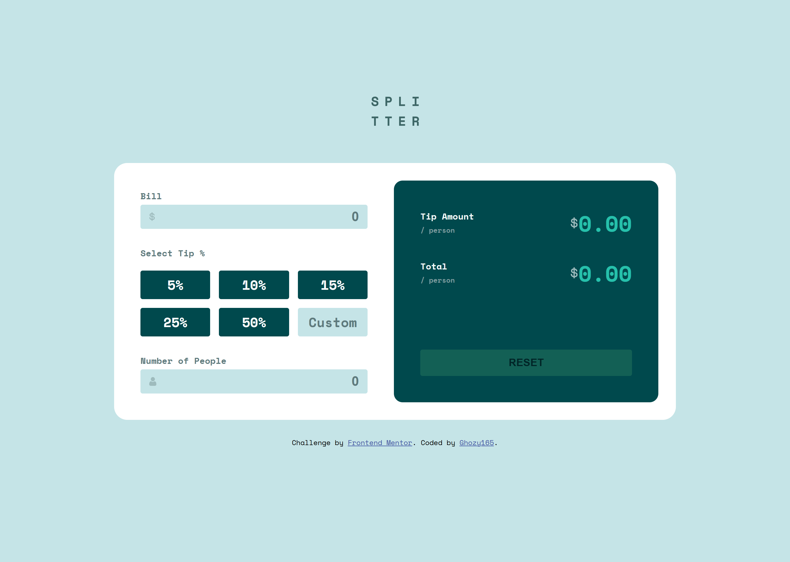

# Frontend Mentor - Tip calculator app solution

This is a solution to the [Tip calculator app challenge on Frontend Mentor](https://www.frontendmentor.io/challenges/tip-calculator-app-ugJNGbJUX). Frontend Mentor challenges help you improve your coding skills by building realistic projects.

## Table of contents

- [Overview](#overview)
  - [The challenge](#the-challenge)
  - [Screenshot](#screenshot)
  - [Links](#links)
- [My process](#my-process)
  - [Built with](#built-with)
  - [What I learned](#what-i-learned)
  - [Continued development](#continued-development)
  - [Useful resources](#useful-resources)
- [Author](#author)
- [Acknowledgments](#acknowledgments)

## Overview

### The challenge

Users should be able to:

- View the optimal layout for the app depending on their device's screen size
- See hover states for all interactive elements on the page
- Calculate the correct tip and total cost of the bill per person

### Screenshot

### Links

- Solution URL: [My Solution](https://github.com/Ghozy165/Tip-Calculator-App)
- Live Site URL: [My Solution](https://tip-calculator-app-nine-omega.vercel.app/)

## My process

### Built with

- Semantic HTML5 markup
- CSS custom properties
- Flexbox
- CSS Grid
- Mobile-first workflow

### What I learned

- Construct and Deconstruct in JS 
- Make Function smaller as it could, for more readable, reuseable, and maintainable

### Continued development

- Using Sematic HTML correctly 
- Make code that readable, reuseable, and maintainable

### Useful resources

- [HTML CHEAT SHEET](https://htmlcheatsheet.com/) - This helped me for know HTML CSS and JS

## Author

- Frontend Mentor - [@Ghozy165](https://www.frontendmentor.io/profile/Ghozy165)

## Acknowledgments

Thanks to Frontend Mentor for Guidence and Inpiration